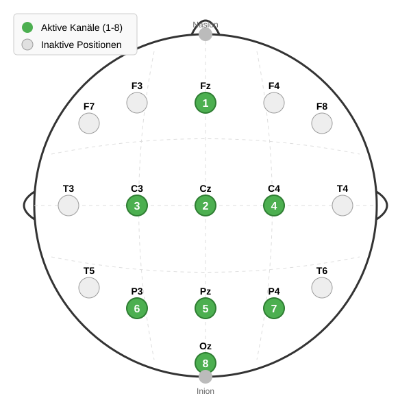

# RedLightGreenLight EEG Projekt

Willkommen beim RedLightGreenLight EEG Projekt. Diese Anwendung nutzt EEG-Signale (Elektroencephalographie), um das Spiel "Red Light, Green Light" zu steuern.
Ziel des Spiels ist es, eine Figur während der "Green Light" Phase (grüner Bildschirm) zum rechten Bildschirmrand zu bewegen. Während der "Red Light" Phase (roter Bildschirm) muss die Figur stillstehen.
Bewegt sich die Figur während der "Red Light" Phase, so wird die Spielfigur zurückgesetzt. 
Zur Steuerung wird das Verhältnis zwischen Beta- und Alpha-Wellen gemessen, um die Intention des Nutzers zu bestimmen. Ist der Nutzer entspannt, so ist das Verhältnis niedrig und die Figur bleibt stehen. Ist der Nutzer konzentriert, so ist das Verhältnis hoch und die Figur bewegt sich.
Die beiden Zustände können durch das Schließen der Augen (entspannt) und das Öffnen der Augen (konzentriert) herbeigeführt werden. Alternativ können auch auf dem Bildschirm angezeigte Rechenaufgaben gelöst werden, um den konzentrierten Zustand herbeizuführen. Letzteres ist jedoch weniger zuverlässig.

## Schnellstart

1.  **Anforderungen installieren:**
    ```bash
    pip install -r requirements.txt
    ```
2.  **Unicorn Hybrid Black anbringen:**

    Das Unicorn Hybrid Black wird auf dem Kopf des Nutzers angebracht (siehe Abschnitt Versuchsaufbau).
3.  **Einstellung der Seriennummer:** 

    Die Seriennummer des verwendeten Unicorn Hybrid Black muss ggf. in der Datei `EEG/EEGManager.py` in der Variable `self._serial_number` eingetragen werden.
4.  **Anwendung starten:**
    ```bash
    python Main.py
    ```
5.  **Kalibrierung durchführen:**
    Nach dem Start der Anwendung wird der Nutzer aufgefordert, eine Kalibrierung durchzuführen. Hierbei wird der Nutzer aufgefordert, für 30 Sekunden entspannt zu sein und für 30 Sekunden konzentriert zu sein. 
6.  **Spiel starten:**
    Nach der Kalibrierung wird das Spiel gestartet.
    Im konzentrierten Zustand bewegt sich die Figur, im entspannten Zustand bleibt sie stehen.
    Spieleinstellungen können im Menü (Esc) vorgenommen werden.


## Dokumentation

Für ein detailliertes Verständnis der Projektstruktur und der Signalverarbeitung lesen Sie bitte die folgenden Dokumente:

*   **ProjectStructure.pdf**: Erklärt die interne Architektur, die Signalverarbeitungspipeline und die BCI-Steuerung.
*   **GameDetails.pdf**: Details zur Spielimplementierung, MVC-Struktur und verwendeten Design-Patterns.

## Funktionen

*   **Echtzeit-EEG-Verarbeitung**: Übersetzt Gehirnaktivität durch spezialisierte Spektralanalyse in Spielbewegungen.
*   **Interaktive Kalibrierung**: Personalisierte Schwellenwertbestimmung basierend auf entspannten und konzentrierten Zuständen.
*   **Kanalverhältnis-Analyse**: Nutzt das Verhältnis zwischen Frontal-Beta (Kanal 1) und Okzipital-Alpha (Kanal 8) zur Fokus-Erkennung.
*   **Zeitbasierte Entprellung (Debounce)**: Verhindert versehentliche Bewegungs-Trigger durch kontinuierliche Zustandsverifizierung.
*   **Mock-Modus**: Integrierte Unterstützung für Tests ohne Unicorn Python API.

## Versuchsaufbau
Das Programm nutzt zur Zeit ausschließlich die Kanäle 1 und 8 des Unicorn Hybrid Black.
Während der Tests wurde die in der nachfolgenden Abbildung dargestellten Elektrodenpositionen verwendet.



## Fehlerbehebung & Feinabstimmung

Wenn sich die BCI-Steuerung träge oder instabil anfühlt, können Sie diese Kernparameter anpassen:

### 1. Empfindlichkeit anpassen
Wenn es zu schwer oder zu einfach ist, den "Konzentriert"-Zustand zu erreichen.

- **Datei**: `Calibration/CalibrationModel.py`
- **Parameter**: `self._sensitivity` (Standard: `0.7`)
- **Aktion**:
    - **Zu schwer?** Verringern (z.B. `0.5` oder `0.6`).
    - **Zu einfach?** Erhöhen (z.B. `0.8`).

### 2. Stabilität (Debounce-Dauer)
Steuert, wie lange ein Zustand kontinuierlich gehalten werden muss, um eine Änderung auszulösen.

- **Datei**: `EEG/RealTimeProcessor.py`
- **Parameter**: `self._duration_threshold` (Standard: `0.5` Sekunden)
- **Aktion**:
    - **Flackernder Zustand?** Erhöhen auf `0.7` oder `1.0`.
    - **Verzögerte Reaktion?** Verringern auf `0.3` (Warnung: kann Fehlalarme erhöhen).

### 3. Hysterese-Marge
Die "Pufferzone" um den Schwellenwert, um schnelles Umschalten zu verhindern.

- **Datei**: `Calibration/CalibrationModel.py`
- **Parameter**: `self._margin_ratio` Berechnungsfaktor (Standard: `0.2`)
- **Aktion**:
    - **Instabiles Schalten?** Faktor erhöhen (z.B. `0.3`).

### 4. Frequenzbänder
Anpassen, wenn individuelle Unterschiede die Erkennung beeinflussen.

- **Datei**: `EEG/SignalProcessor.py`
- **Parameter**: `self._alpha_band`, `self._beta_band`
- **Aktion**: Bereiche verschieben (z.B. Alpha `7-13`, Beta `15-30`), um Rauschen zu vermeiden.
